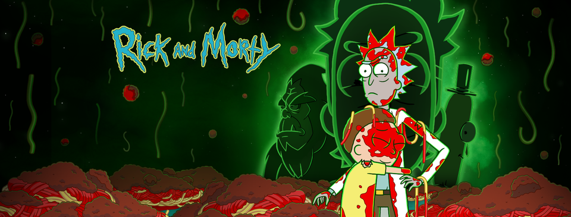

Welcome to the Ricky and Morty fetching/filtering App :D

Just taking some fun with React Query and Styled components.

How to start?

Download/Copy repo -> npm install/npm i -> npm run dev

<Here will be link to the deployed project but later>

Language: Javascript

Library: React

Project: React+Vite

Addons:

-React-Router-Dom

-ReactQuery Tanstack

-react-error-boundary

Styling -Styled Components

